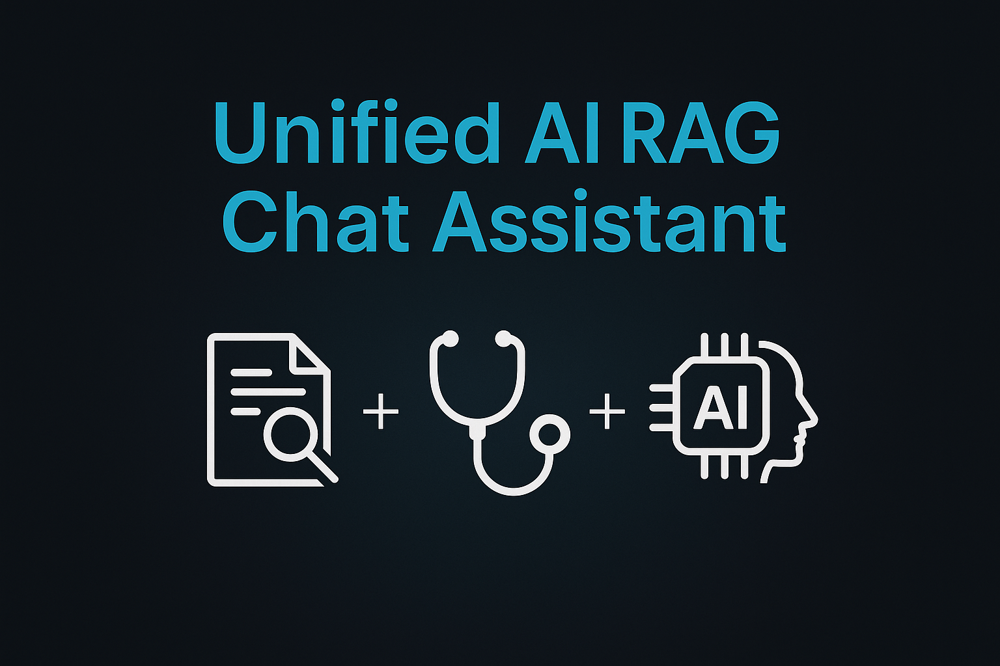

  

# Unified AI RAG Chat Assistant (PDF + Medical)

**📚 Unified AI RAG Chat Assistant (PDF + Medical)**

A dual-mode AI assistant built with Streamlit, HuggingFace LLMs, and FAISS.
Supports intelligent PDF Question-Answering (RAG) and a safe Medical Chat Assistant — all in one clean interface.

🌟 Features
🔍 PDF RAG Chat Mode

Upload any PDF

Automatic text extraction + semantic chunking

FAISS vector search

Cosine similarity filtering

Context-aware answers

Strict “Answer only from PDF” rule

Page-wise source references

🩺 Medical Chat Mode

AI-powered medical Q&A

Safe system prompts

No hallucination (LLM restricted to safe guidelines)

Clear disclaimers

Helpful & simplified explanations

🧠 Core Tech

LLM: HuggingFace Zephyr-7B / Mistral

Embeddings: MiniLM-L6-v2

Vector DB: FAISS

Framework: Streamlit

RAG Pipeline: Custom (retriever + similarity filter + LLM)

Session Memory included
